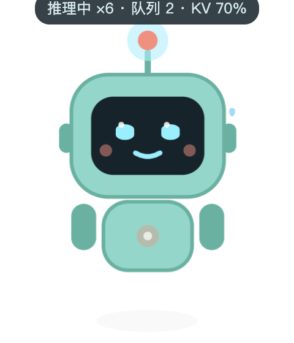
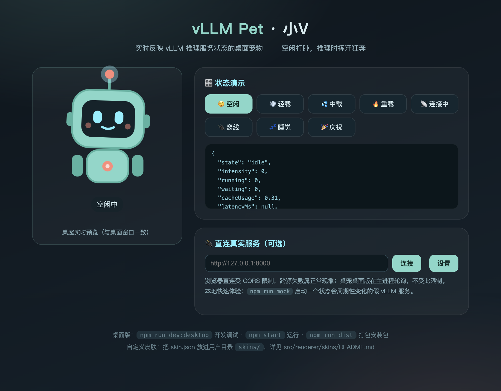

# vLLM Pet · 小V 🐾

> 🤖 **AI 生成声明**：本项目（代码、文档、图标、CI 配置）由 AI Agent（Kimi）全流程编写，
> 人类负责需求提出、效果确认与发布决策。代码未经系统性人工审查，使用与二次开发请自行评估。

一只住在桌面上的 vLLM 推理服务"状态晴雨表"：透明无边框的桌面宠物，定期轮询你的
`vllm serve` 推理服务，根据实时负载切换形象与动画 —— 空闲时打盹，推理时挥汗狂奔。

| 桌宠窗口（推理中 · 中载） | 浏览器预览页 |
| --- | --- |
|  |  |

## 功能特性

- **实时状态联动**：轮询 vLLM 的 `/health` 与 `/metrics`，把负载映射成 7 种视觉状态
- **负载三档动画**：轻载 / 中载 / 重载逐级加速，蒸汽、汗滴、速度线、屏幕闪烁依次上阵
- **情感细节**：忙完一批任务会开心弹跳庆祝；长时间空闲会睡着（Zzz）；服务掉线变灰叹气
- **启动即配置**：首次运行自动打开设置窗口，填入服务地址即可；右键宠物或托盘菜单随时修改
- **条件与动画自定义**：每个负载档位的触发条件（并发 / KV cache 阈值）与播放的动画都能在设置里调整
- **皮肤自定义**：换配色、换动画节奏，甚至整个 SVG 造型都可替换（见
  [src/renderer/skins/README.md](src/renderer/skins/README.md)）
- **跨平台 × 跨架构**：Windows / macOS / Linux，x64 与 arm64 全支持（CI 自动出包）
- **贴心细节**：窗口置顶、鼠标穿透、系统托盘菜单、位置记忆、单实例

## 状态映射规则

数据来源：`GET <apiBase>/health`（失败时 `/v1/models` 兜底）+ `GET <apiBase>/metrics`
解析 `vllm:num_requests_running`、`vllm:num_requests_waiting`、`vllm:gpu_cache_usage_perc`。

| 条件（阈值可配置） | 状态 | 动画 |
| --- | --- | --- |
| 健康检查失败 | 🔌 离线 | 变灰、感叹号气泡、慢速摆动 |
| 启动初期 / 重连中 | 📡 连接中 | 天线快速扫描 |
| running + waiting = 0 | 😌 空闲 | 呼吸、眨眼、偶尔晃脑 |
| 空闲持续 10 分钟 | 💤 睡觉 | 闭眼、Zzz 飘出 |
| ≥ 1（轻载阈值） | 💨 推理中·轻 | 天线脉冲加速、胸口灯闪烁 |
| ≥ 4（中载阈值） | 💦 推理中·中 | 专注眼神、汗滴、蒸汽、手臂摆动 |
| ≥ 16 或 KV cache ≥ 85%（重载阈值） | 🔥 推理中·重 | 极速摆动+抖动、蒸汽喷射、速度线、脸屏闪烁 |
| 忙碌 → 空闲的瞬时 | 🎉 庆祝 | 开心弯眼弹跳 + 闪光（一次性） |

> 老版本 vLLM 没有 `/metrics` 时自动降级为"存活检测"：在线=空闲，掉线=离线。

## 快速开始

环境要求：**Node.js ≥ 20**（推荐 22+）。

```bash
npm install

# 国内网络拉取 Electron 二进制失败时：
# ELECTRON_MIRROR="https://npmmirror.com/mirrors/electron/" node node_modules/electron/install.js

npm run build     # 构建渲染层（首次或改动后）
npm start         # 启动桌宠 🎉
```

首次启动会自动打开设置窗口：填入 vLLM 服务地址（如 `http://127.0.0.1:8000`）、
按需调整状态切换条件与动画映射，保存后立即开始联动。
之后**右键宠物**或点击托盘菜单「⚙️ 打开设置」可随时修改。

### 没有 vLLM 服务？用内置 mock 体验

```bash
npm run mock          # 假 vLLM 服务：http://127.0.0.1:8765
npm run mock -- --cycle   # 每 8 秒在 空闲→轻载→中载→重载 间循环，适合看全套动画
```

设置面板里把服务地址填成 `http://127.0.0.1:8765` 即可。

### 浏览器预览（不用启动桌面版）

```bash
npm run dev           # 打开 http://localhost:5173 ：状态演示面板 + 全部动画
```

### 开发调试（代码热更新）

```bash
npm run dev:desktop   # vite dev server + Electron 联动，改渲染层代码即时生效
```

## 配置说明

配置保存在 Electron `userData` 目录的 `config.json`：

| 系统 | 路径 |
| --- | --- |
| macOS | `~/Library/Application Support/vllm-pet/config.json` |
| Windows | `%APPDATA%/vllm-pet/config.json` |
| Linux | `~/.config/vllm-pet/config.json` |

| 字段 | 默认 | 说明 |
| --- | --- | --- |
| `apiBase` | `""` | vLLM 服务地址，空 = 未配置（首次运行自动打开设置窗口） |
| `apiKey` | `""` | 可选，携带 `Authorization: Bearer <key>` |
| `pollIntervalMs` | `2000` | 轮询间隔 |
| `healthPath` / `metricsPath` | `/health` `/metrics` | 端点路径，可自定义 |
| `thresholds` | `{light:1, medium:4, heavy:16, cacheHeavy:0.85}` | 负载分档阈值（并发 = running + waiting） |
| `stateMap` | `{light:busy-1, medium:busy-2, heavy:busy-3}` | 各负载档位播放的动画（busy-1 轻快 / busy-2 中速 / busy-3 狂热） |
| `showStatus` | `true` | 是否在宠物下方显示状态文本（"铭牌"气泡） |
| `skin` | `default-robot` | 皮肤名 |
| `idleSleepMinutes` | `10` | 连续空闲多久后睡觉 |
| `window` | 见源码 | 置顶 / 鼠标穿透 / 缩放 / 透明度 / 位置 |

## 自定义皮肤

在 `userData/skins/<皮肤名>/` 放一个 `skin.json`（可再加 `robot.svg` 整体换造型），
设置面板里选择即可生效。完整教程与 SVG class 钩子表：
**[src/renderer/skins/README.md](src/renderer/skins/README.md)**

最小示例（只换配色）：

```json
{
  "name": "pink-bot",
  "displayName": "粉色小V",
  "version": 1,
  "palette": { "body": "#ffb3c7", "bodyShade": "#e085a2", "accent": "#7ef0ff" }
}
```

## 跨平台打包

```bash
npm run dist                 # 本机平台安装包 → out/
```

打 tag 推送到 GitHub 后，`.github/workflows/release.yml` 自动构建全平台安装包并创建
**GitHub Release**（附更新日志与全部安装包）：

| 平台 | 架构 | 产物 |
| --- | --- | --- |
| Windows | x64 / arm64 | NSIS 安装器 + 便携版 |
| macOS | x64 / arm64 | DMG + ZIP |
| Linux | x64 / arm64 | AppImage + deb |

## 项目结构

```
pet.html / index.html      # 桌宠窗口页 / 浏览器预览页
src/shared/status-core.js  # 纯函数：Prometheus 解析 + 状态推导（主进程与渲染层共用）
src/renderer/              # 渲染层
  robot/                   #   PetView + 全部状态动画（SVG + CSS）
  status/                  #   状态机 + IPC/Mock/直连 三种状态来源
  skins/default-robot/     #   内置皮肤"小V"
  ui/settings-panel.js     #   气泡设置面板
src/main/                  # Electron 主进程：窗口/托盘/轮询/配置/皮肤目录/IPC
scripts/                   # mock-vllm / dev-desktop / smoke / generate_icons
tests/                     # node --test 单元测试
```

## 验证与测试

```bash
npm test        # 状态解析/推导单元测试
npm run smoke   # 集成冒烟：隐藏窗口启动 + 截图 smoke-pet.png
```

想参与开发或让 AI Agent 继续迭代？架构、约定与排坑指南见 **[DEVELOPMENT.md](DEVELOPMENT.md)**。

## 常见问题

- **预览页"直连真实服务"失败？** 浏览器跨源受 vLLM 服务的 CORS 限制，属正常现象；
  桌面版在主进程轮询，不受此限制。
- **开了"鼠标穿透"点不到宠物了？** 右键托盘图标 → 取消勾选"鼠标穿透"。
- **Linux 下窗口不透明？** 需要运行中的合成器（compositor）；部分窗口管理器需额外开启透明支持。
